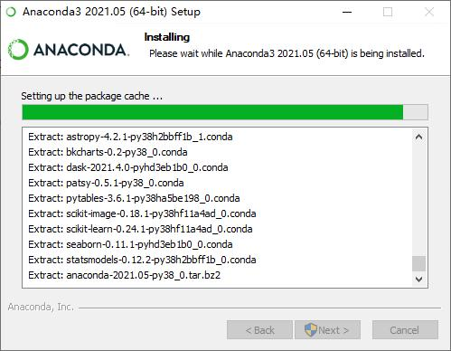
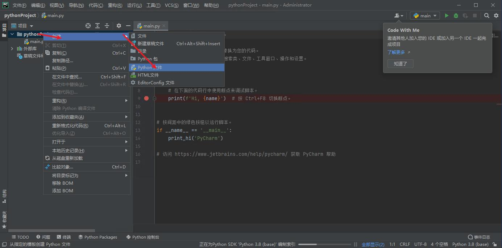

# Python安装指导

如果网速慢，图片加载不出来，可以试试[Gitee的仓库](https://gitee.com/rocketma/Guidance/blob/main/guidance.md "gitee.com")

## `[1]`Anaconda

### 1.明确系统版本与位数

**所安装电脑至少需要2G内存（图中的机带RAM，一般不超过32G，非存储空间）**  
  
  
(Windows 7可能不一样，但都是找这两个信息)记住你的电脑位数与版本，过会儿会用到

### 2.下载Anaconda

**在这种情况中不需要到python.org下载python！**  
如果你用的是win10的电脑，打开 [Anaconda Individual Edition](https://www.anaconda.com/products/individual)：  

如果你用的是win7，则在[Anaconda archive](https://repo.anaconda.com/archive/)：  
  
图中版本：`Anaconda3 5.2.0`  
由于完整装完Anaconda需要2G左右空间，若喜欢折腾可以跳到`附录1`部分以节省宝贵的磁盘空间，以及更快的扫描索引速度（下文会提及）

### 3.安装Anaconda和PyCharm

  
  
使用360的用户***一定***要在弹窗弹出来时选择**允许操作**!  
  
Anaconda的安装细节已给出，在第一张图中勾上第一个单选框，剩下只需要next就行。  

## `[2]`Visual Studio Code(VS Code)

### 1.下载VS Code

为什么要选择VS Code而非IDLE,Spyder？VS Code是现在编Python的IDE中市场份额第二的IDE，虽然没有Pycharm智能，但仍然具有**自动补全，快速错误检查，代码优化，丰富的快捷键，缩短开发周期（原来30分钟可以缩短到15分钟），快速修复**等功能，并且设置更简单，更接近Spyder，插件丰富。

打开网址:[VS Code](https://code.visualstudio.com/ "vsc download")  
如果你的电脑是64位:  
  

如果你的电脑是32位:  
  

### 2.安装VS Code

注意以下图片上的选项，其余的按下一步即可  

### 3.配置VS Code

需要下载一下中文和Python插件  
  
  

### 4.开始编程吧

  
  
  
然后给你的文件起个名，像Spyder一样  
写完程序后，可以执行格式化来使你代码更好看  
**此处的右键指在空白处右键而不是右键菜单**  
熟练后可以直接使用快捷键`Shift`+`Alt`+`F`  
  
*第一次使用需要安装`autopep8`*
  
  
  

如果出现Python开始界面，请将其关闭  

### 5.运行你的代码

  
  

### +.更换颜色主题

觉得颜色太深？  
  
  

## `[3]`PyCharm

**(`[2]`,`[3]`中任选其一)**

### 1.下载PyCharm（**完成此步需要64位电脑！若为32位，请移步`[2]`或`附录3`**）

为什么要选择PyCharm而非IDLE，Spyder？PyCharm作为目前市场占有率最高的python IDE，具有**自动补全，快速错误检查，调试表达式快速计算，代码优化，丰富的快捷键，自动导入，缩短开发周期（原来30分钟可以缩短到10分钟），快速修复**等。  
打开[Pycharm Download](https://www.jetbrains.com/pycharm/download/#section=windows "下载PyCharm")，下载Community版，**不要选错**！：  

### 2.安装PyCharm

  
  
PyCharm安装细节已给出，剩下无脑next。  
接下来在桌面上打开，按图中操作，需要网络，完成操作后会有一个弹窗，按”Restart now”。此时PyCharm变成中文。最后一张图是PyCharm的启动画面。  
  
  
  
  
  
  

### 3.配置Python解释器

首先要新建一个项目（PyCharm很在意项目管理），以后要写代码，需要打开此代码，**不要直接打开.py文件编辑！** 可以现将其复制到项目路径下打开再编辑。（可以直接把文件复制，再在之后所展示的窗口中选中pythonProject（或你自己改的名字）右键粘贴）  
  
  
  
  
  
  
  
  

### 4.设置运行配置并开始编写你的代码

由于PyCharm不以单个文件为操作单位，而操作整个项目，所以新建完一个文件以后直接运行并不会运行你想要的文件。下面给出了具体的配置方法，也可按下main的启动配置（一个左上角带三角形的小框）->编辑启动配置->左上角“+”号->python->键入配置名称（一般为你的python文件名）以及脚本路径（按右边文件夹按钮，往下拉一拉就能找到你的文件了）->确定，就能在下拉框里找到你的启动配置了。选中它，再按运行就可以运行你的文件了。**在再次运行你的文件时，如果运行的文件不对，看看是不是启动配置选错了。**  
  
  
  
  
  
  
若看黑色窗口不习惯，可以换白色主题。更多小知识可以在`附录2`中了解。  
  
  

## 附录1：使用Miniconda而非Anaconda

顾名思义，miniconda是anaconda的最小分发版，只包含了conda和纯python，若想使用书上提到的pandas、PIL.Image、matplotlib等模块，需要先进行安装，下面的例子说明了如何安装，请依样画葫芦完成剩余模块的安装。Miniconda和Anaconda下载网址不同，可以使用清华源[Tsinghua source](https://mirrors.tuna.tsinghua.edu.cn/anaconda/miniconda/ "Tsinghua source")进行下载。安装时跟Anaconda差不多。win7的版本同上，Win10下载[Miniconda3-py38_4.9.2-Windows-x86.exe](https://mirrors.tuna.tsinghua.edu.cn/anaconda/miniconda/Miniconda3-py38_4.9.2-Windows-x86.exe "32bit")（32位）/ [Miniconda3-py38_4.9.2-Windows-x86_64.exe](https://mirrors.tuna.tsinghua.edu.cn/anaconda/miniconda/Miniconda3-py38_4.9.2-Windows-x86_64.exe "64bit")（64位）。安装完后十分干净，不带多余组件，大约占用500M存储空间。必要的模块有：`pillow`, `matplotlib`, `pyqt`, `pandas`, `flask`, `numpy`, `scipy`, `jieba`。嫌下载慢，可以参考网上教程[知乎教程](https://zhuanlan.zhihu.com/p/133494097 "知乎教程")。  
此处以安装`pep8`为例，首先按`win`键，在Anaconda（是的你没看错）目录中找到`Anaconda Powershell Prompt (miniconda3)`，然后单击以运行：  
  
  
  

## 附录2：更好使用PyCharm

1.PyCharm有3种基本问题提醒：错误（红色圆圈），警告（黄色三角），弱警告（淡黄色三角），拼写错误（绿色钩子），错误一定会出错，警告则有可能导致错误，后两者不会导致错误，只是建议做更改以提高程序可读性等，一些通过格式化就能解决。PyCharm提示速度很快，错误的位置会用对应颜色的波浪线画出。  
2.`Ctrl` + `Alt` + `↑`/`↓` :快速将选中的行上移/下移一行  
3.`Ctrl` + `Alt` + `L` :快速格式化代码  
4.`Ctrl` + `/` :注释当前行  
5.`Alt` + 鼠标单击多处 :多光标  
6.`Alt` + `Shift` + 鼠标下拉 :多光标（在同一列上）  
7.`Shift` + `F6` :快速给变量（函数、文件）改名（会更改所有涉及到的而无需一个一个改）  
8.`Ctrl` + `Y` :配置成删除行，可以快速删除当前行  
9.更多请移步`帮助`  

## 附录3：仍要使用Spyder或IDLE

**不推荐**！两者都是占有率只有2%的IDE（Pycharm 32%）！  
若不需要用到pandas等模块，只需要python的基本模块（random等），请移步[Python官网](https://www.python.org/ "Python官网") ，win10建议下载python3.8.10，win7需下载3.6.8，点进去按你电脑的位数下载。**若已安装了纯python，请不要勾选第4步中第一张图中的复选框！**  
安装完纯Python后，可以在程序目录处找到IDLE。  
要使用Spyder，安装完Anaconda后，Spyder会自动安装，在程序目录处找到其即可。  

## 版权声明

(C) Copyright 2021 Rocket, 遵守GPL 3.0许可
